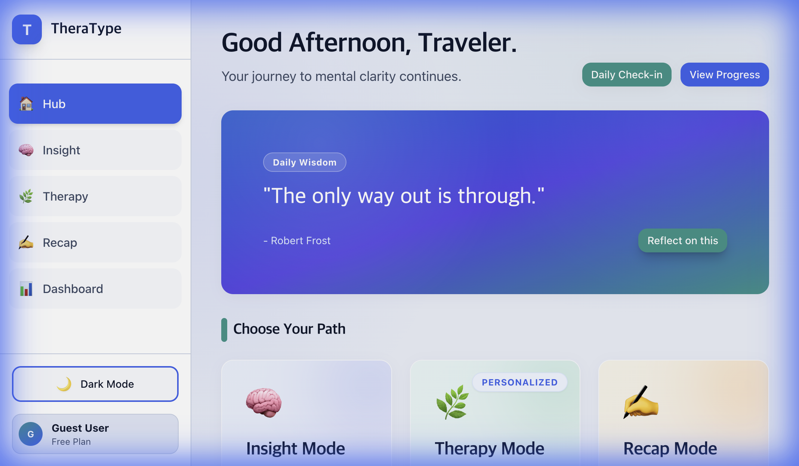
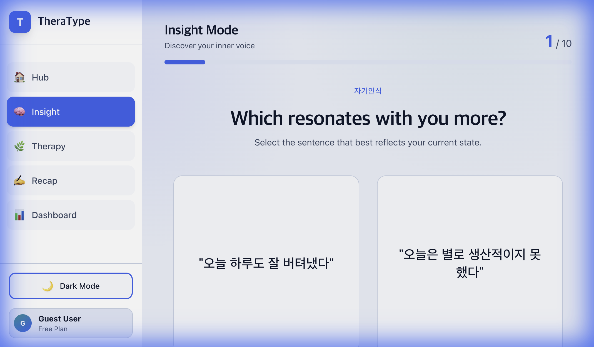
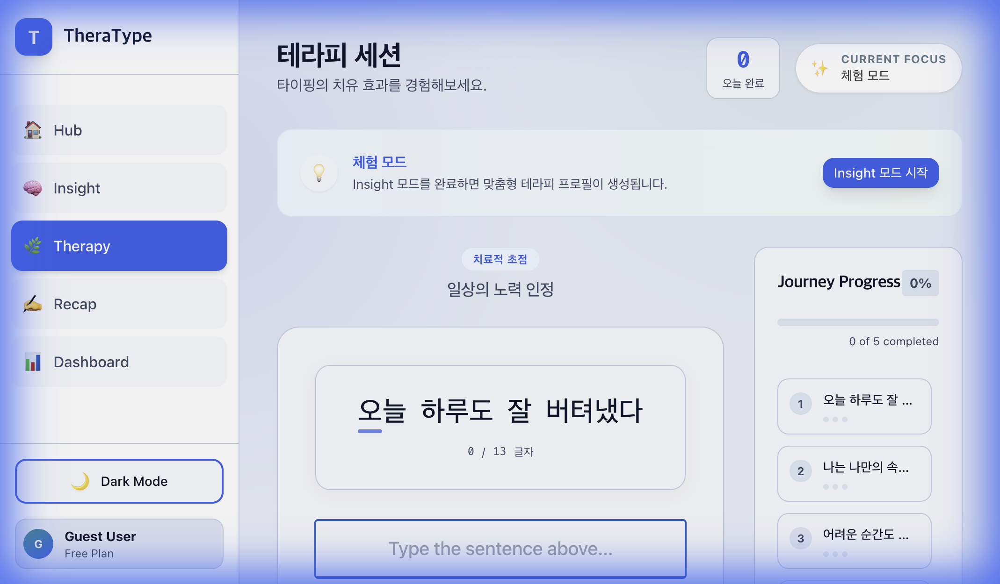
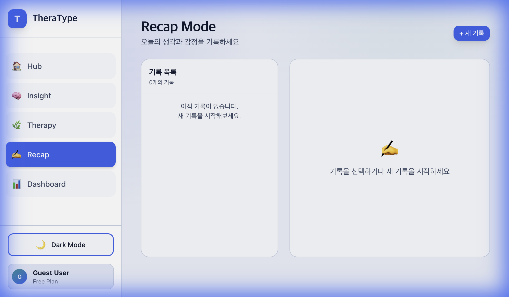
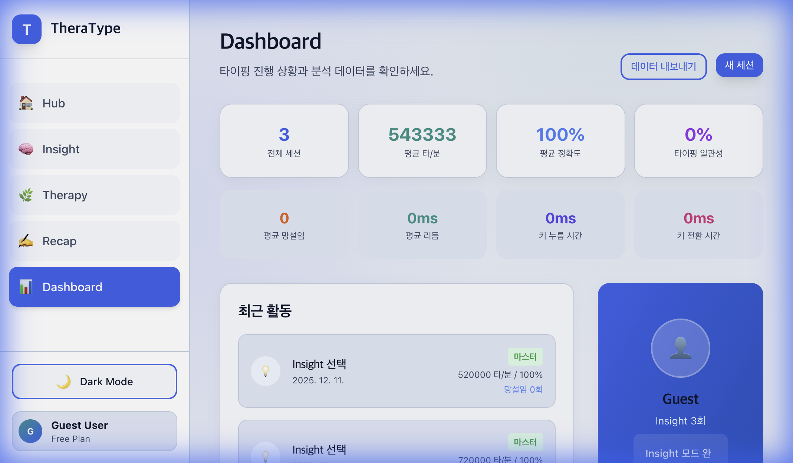

# TheraType (테라타입)

**Therapeutic Typing Platform - 치유적 타이핑 플랫폼**

> 타이핑 실력 향상과 정신 건강 증진을 동시에 달성하는 디지털 헬스케어 플랫폼

---

## 🎯 프로젝트 개요

TheraType은 타자연습과 정신건강 케어를 결합한 혁신적인 디지털 치료제(Digital Therapeutics) 플랫폼입니다.

**이중 가치 제안 (Dual Value Proposition)**
- **즉각적 가치**: 타이핑 속도 및 정확도 향상 (측정 가능한 스킬)
- **장기적 가치**: 정신건강 증진 (스트레스 감소, 자존감 향상, 긍정적 자기대화)

---

## 🚀 빠른 시작

### 사전 요구사항

- Node.js 18.0+
- npm 9.0+
- Firebase 프로젝트 (선택적, 로컬 개발 시 mock 데이터 사용 가능)

### 설치 및 실행

```bash
# 1. 의존성 설치
npm install

# 2. 환경 변수 설정 (Firebase 사용 시)
cp .env.example .env.local
# .env.local 파일을 열어 Firebase 설정 입력

# 3. 개발 서버 실행
npm run dev

# 브라우저에서 http://localhost:5173 접속
# → MainHub 화면에서 원하는 모드 선택
#   - Insight Mode: 자기인식 평가 (10개 문장 쌍)
#   - Therapy Mode: 긍정 문장 타이핑 (맞춤형 or 데모)
#   - Dashboard: 진행 현황 확인
```

### 빌드

```bash
# 프로덕션 빌드
npm run build

# 빌드 결과 미리보기
npm run preview
```

---

## 📁 프로젝트 구조

```
theratype/
├── src/
│   ├── components/          # 재사용 가능한 컴포넌트
│   │   ├── common/          # 공통 컴포넌트 (Button, Input, Card 등)
│   │   ├── layout/          # 레이아웃 컴포넌트 (Header, Footer)
│   │   ├── auth/            # 인증 관련 컴포넌트
│   │   ├── insight/         # Insight Mode 컴포넌트
│   │   ├── therapy/         # Therapy Mode 컴포넌트
│   │   └── dashboard/       # 대시보드 컴포넌트
│   │
│   ├── pages/               # 페이지 컴포넌트
│   ├── contexts/            # React Context (전역 상태)
│   ├── hooks/               # Custom Hooks
│   ├── utils/               # 유틸리티 함수 (타이핑 분석 등)
│   ├── services/            # 외부 서비스 (Firebase 등)
│   ├── data/                # 정적 데이터 (문장 라이브러리)
│   ├── styles/              # 글로벌 스타일
│   │
│   ├── App.jsx              # 메인 앱 컴포넌트
│   ├── main.jsx             # 엔트리 포인트
│   └── index.css            # Tailwind CSS
│
├── public/                  # 정적 파일
├── .env.example             # 환경 변수 예시
├── vite.config.js           # Vite 설정
├── tailwind.config.js       # Tailwind CSS 설정
└── package.json
```

---

## 🌟 핵심 기능 (Core Features)

### 0️⃣ 메인 허브 (Main Hub)

**시작점**: 모든 모드로의 접근성을 제공하는 중앙 허브입니다.



### 1️⃣ Insight Mode (인사이트 모드)

**컨셉**: 타이핑을 통한 자기인식 및 선호도 탐색

- 두 개의 대조되는 문장 제시
- 공감하는 문장을 타이핑하여 선택
- 누적 선택 패턴으로 심리 프로파일 구축
- 시각화된 인사이트 제공



**과학적 근거**: Expressive Writing Paradigm (Pennebaker, 1986), Keystroke Dynamics (Epp et al., 2011)

### 2️⃣ Therapy Mode (테라피 모드)

**컨셉**: 개인 맞춤형 긍정 자극 타이핑 훈련

- Insight Mode 결과 기반 프로파일 분류
- 프로파일별 치료적 문구 제공
- 타이핑하며 긍정 메시지 내면화
- 적응형 난이도 조절



**과학적 근거**: Self-Affirmation Theory (Steele, 1988), Cognitive Behavioral Therapy

### 3️⃣ Recap Mode (회고 모드)

**컨셉**: 자기 성찰을 위한 저널링

- 오늘의 감정과 생각을 자유롭게 기록
- 마크다운 에디터 지원
- 다크모드 대응 글쓰기 환경



### 4️⃣ 진행 추적 대시보드

- 타이핑 속도/정확도 향상 그래프
- 감정 상태 변화 추이
- 연속 사용 일수 (스트릭)
- 프로파일별 마스터한 문장 수



---

## 🔧 기술 스택

### 프론트엔드
- **Framework**: React 18 + Vite
- **Styling**: Tailwind CSS
- **Routing**: React Router v6
- **State Management**: React Context API
- **Data Visualization**: Chart.js + react-chartjs-2

### 백엔드 & 인프라
- **BaaS**: Firebase (Authentication + Firestore)
- **Hosting**: Firebase Hosting

---

## 📚 참고 문서

### 가이드
- **[사용자 가이드 (User Guide)](docs/USER_GUIDE.md)**: 상세 사용법 및 시나리오

### 프로젝트 문서
- `../AGENTS.md`: 프로젝트 개요 및 핵심 컨셉
- `../PROJECT_PROPOSAL.md`: 최종 제안서
- `../MVP_SPECIFICATION.md`: 4주 구현 범위
- `../TECHNICAL_ARCHITECTURE.md`: 시스템 설계

### 에이전트 작업물
- `../agents_context/technical/`: 기술 설계 문서
- `../agents_context/product/`: UI/UX 설계 및 콘텐츠
- `../agents_context/implementation/`: 개발 가이드

---

## 📄 라이선스

이 프로젝트는 MIT 라이선스를 따릅니다.

**버전**: 0.1.0 (MVP)
**최종 수정**: 2025-10-30
